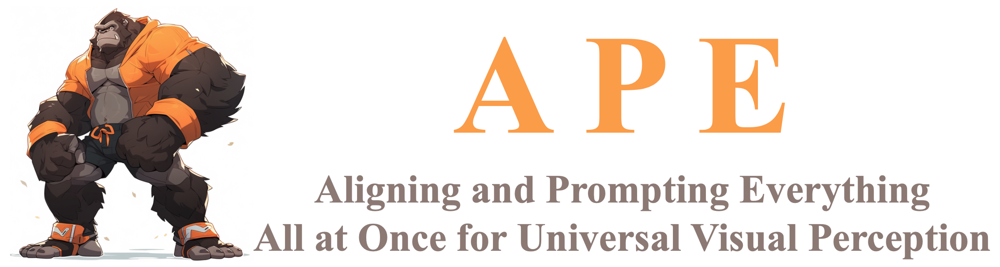

# APE: Aligning and Prompting Everything All at Once for Universal Visual Perception


<p align="center">
    
</p>


<font size=7><div align='center' > :grapes: \[[arXiv Paper](https://arxiv.org/abs/2312.02153)\] &nbsp; :apple: \[[Online Demo](https://huggingface.co/spaces/shenyunhang/APE)\] </div></font>


---
This repository contains a modified implementation of the CVPR 2024 paper *APE: Aligning and Prompting Everything All at Once for Universal Visual Perception*. You can use a simple command to extract pixel-aligned semantic features from any images.


## :hammer_and_wrench: Install 

1. Clone the APE repository from GitHub:

```bash
git clone https://github.com/shenyunhang/APE
cd APE
```

2. Install the required dependencies and APE:

```bash
pip3 install -r requirements.txt
python3 -m pip install -e .
```

3. Download the `APE-L_D` checkpoint (also referred to as `APE-D` in older versions) and place it in the root directory. <a href="https://huggingface.co/shenyunhang/APE/blob/main/configs/LVISCOCOCOCOSTUFF_O365_OID_VGR_SA1B_REFCOCO_GQA_PhraseCut_Flickr30k/ape_deta/ape_deta_vitl_eva02_clip_vlf_lsj1024_cp_16x4_1080k_mdl_20230829_162438/model_final.pth">HF link</a> 


## :arrow_forward: Extract the Pixel-Aligned Semantic Feature for Images

```shell
python demo/demo_lazy.py -i ../datasets/360/bicycle/images_4/* --feat-out ../datasets/360/bicycle/clip_feat/
# Use * for the -i option to process multiple images (to iterate through all the images in the folder).
# Alternatively, you can specify multiple images explicitly:
# python demo/demo_lazy.py -i img1.png img2.png img3.png --feat-out ../datasets/360/bicycle/clip_feat/
```


## :black_nib: Citation

If you find this repo useful, please cite both papers:

```bibtex
@article{goi2024,
    title={GOI: Find 3D Gaussians of Interest with an Optimizable Open-vocabulary Semantic-space Hyperplane},
    author={Qu, Yansong and Dai, Shaohui and Li, Xinyang and Lin, Jianghang and Cao, Liujuan and Zhang, Shengchuan and Ji, Rongrong},
    journal={arXiv preprint arXiv:2405.17596},
    year={2024}
}
```

and

```bibtex
@inproceedings{APE,
  title={Aligning and Prompting Everything All at Once for Universal Visual Perception},
  author={Shen, Yunhang and Fu, Chaoyou and Chen, Peixian and Zhang, Mengdan and Li, Ke and Sun, Xing and Wu, Yunsheng and Lin, Shaohui and Ji, Rongrong},
  journal={CVPR},
  year={2024}
}
```
